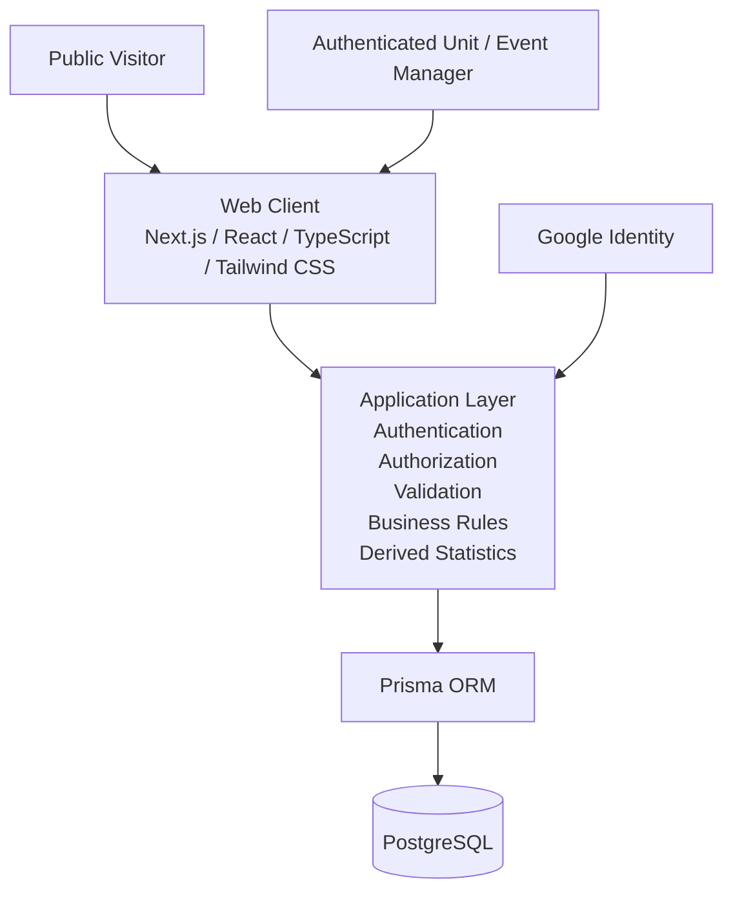
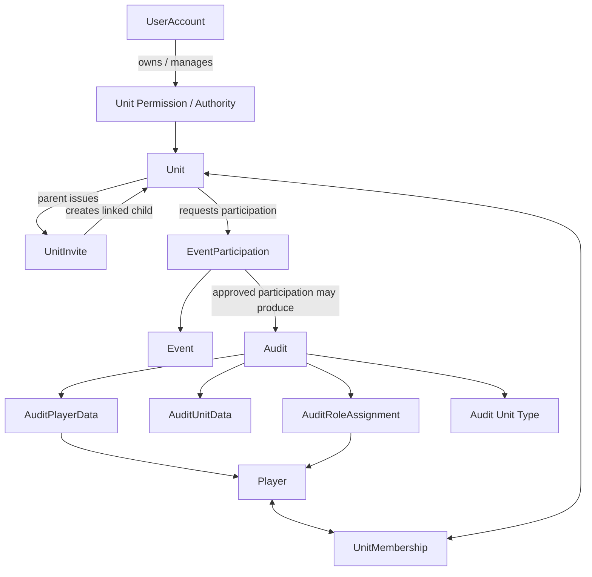
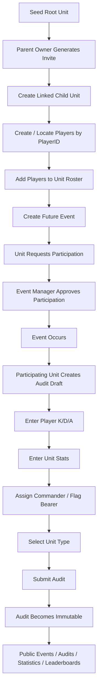

# morale.gg Architecture Overview

**Status:** Provisional and evolving  
**Scope:** Current high-level architecture for the morale.gg MVP  
**Initial game scope:** Napoleonic Wars only

This document describes the current accepted high-level architecture and domain relationships for morale.gg.

It is **not** a final database schema or detailed implementation specification. Exact classes, tables, fields, cardinalities, APIs, and module contracts must be established through tickets, module documentation, contracts, BCRs, and ADRs as development proceeds.

Where this document conflicts with `docs/SYSTEM.md` or a later approved ADR, the higher-authority source governs.

---

## 1. Product Architecture Goal

morale.gg is a web application for structured Napoleonic Wars communities to:

- represent linked hierarchical units;
- maintain unit rosters;
- represent persistent players using game-specific PlayerIDs;
- create and manage events;
- request and approve unit participation;
- submit structured post-event audits;
- preserve historical organizational and performance data;
- expose public read-only units, rosters, events, audits, basic statistics, and leaderboards.

The primary MVP management workflow is desktop-oriented. Public viewing should remain reasonably usable on smaller screens.

---

## 2. System Context



### Planned Responsibilities

**Web Client**

- public read-only browsing;
- authenticated management UI;
- responsive presentation;
- client-side interaction and form state;
- frontend visibility/gating for UX only.

**Application Layer**

- Google-authenticated user/session handling;
- authoritative authorization;
- unit ownership and delegated-permission rules;
- invite validation;
- event date/time validation;
- participation request/approval workflow;
- audit validation and submission locking;
- business-rule enforcement;
- derived statistics.

**Persistence Layer**

- persistent users/accounts;
- persistent players;
- unit hierarchy;
- membership history;
- unit ownership/permissions;
- invites;
- events;
- participation requests/approvals;
- audits and audit details;
- historical records.

**Google Identity**

- external authentication provider for website accounts.

Frontend visibility is not sufficient authorization. Permission-sensitive behavior must be enforced by the application layer.

---

## 3. Core Domain Concepts

The following are conceptual domain objects or responsibilities. They are not necessarily one-to-one with final database tables.

### UserAccount

Represents an authenticated website identity.

Important distinction:

```text
UserAccount != Player
```

Only unit/event managers require accounts for core MVP writes. Other people may create accounts, but account existence does not itself grant management authority.

---

### Player

Represents a persistent Napoleonic Wars player.

Current MVP rules:

- identified by a game-specific PlayerID;
- normally introduced into the system by a unit manager;
- persists after removal from a roster;
- may belong to multiple units simultaneously;
- may later have richer public historical profiles, but dedicated profiles are post-MVP.

---

### Unit

Represents an organizational unit.

Current MVP rules:

- units form an arbitrary-depth hierarchy;
- root units are manually seeded;
- non-root units are normally created through a parent-issued invite;
- each unit has exactly one owner;
- additional authenticated users may receive delegated permissions.

Conceptually:

```text
Root Unit
└── Child Unit
    └── Child Unit
        └── ...
```

---

### UnitInvite

Represents temporary authority from an existing parent unit to create a linked child unit.

Using a valid invite:

1. creates/authorizes creation of the child unit;
2. establishes the parent-child relationship;
3. establishes the initial child-unit owner according to the approved workflow.

Exact token representation, expiration model, and storage are implementation decisions.

---

### UnitPermission / Management Authority

Represents delegated authority associated with a unit.

The MVP requires:

- exactly one unit owner;
- owner-granted manager permissions;
- `MANAGE_EVENTS` permission for standalone Event creation eligibility;
- protected roster/unit operations;
- parent-unit authority over subordinate ownership according to the eventual permission design.

The exact permission matrix is not yet final.

---

### UnitMembership

Represents the relationship between a Player and a Unit.

Current MVP rules:

- a player may belong to multiple units simultaneously;
- duplicate active membership for the same player/unit is invalid;
- removal from an active roster does not destroy historical membership;
- later rejoining should preserve earlier history.

The final persistence model for membership periods remains undecided.

---

### Event

Represents an organized Napoleonic Wars event.

Current MVP rules:

- owned by exactly one authenticated User, who is the creator;
- creation requires any currently effective Unit `MANAGE_EVENTS` permission;
- the qualifying Unit or grant is not stored on the Event and grants no
    post-creation Event authority;
- existing Event management belongs only to the owner and explicitly
    Event-authorized Users;
- Event manager administration is owner-only;
- Events have no Unit ownership or authority anchor;
- normal MVP creation is for future events only;
- an event cannot be created with a scheduled time already in the past;
- event information may be edited while eligible;
- an event may be cancelled/deleted only before it occurs and only when no audit exists.

Initial event information includes:

- name;
- scheduled date/time;
- event type;
- description;
- opponent when relevant;
- map when relevant.

---

### EventParticipation

Represents a unit's requested or approved involvement in an event.

This is conceptually richer than a passive join table because it has workflow state.

Typical conceptual states:

```text
REQUESTED
APPROVED
DENIED
```

Current MVP rules:

- participation is requested by an authorized unit manager;
- all requests are manually approved or denied by an authorized event manager;
- duplicate active participation/request relationships are prevented;
- only approved participation is eligible for an audit.

The final state model is an implementation/design decision.

---

### Audit

Represents the participating unit's structured record for an event.

The audit belongs conceptually to:

```text
approved EventParticipation
```

rather than directly to an Event or Unit in isolation.

Current MVP rules:

- one submitted audit per eligible unit-event participation;
- only the participating unit's authorized manager may create/edit it;
- it may be edited before submission;
- once submitted, it is immutable in the MVP;
- submitted data becomes authoritative historical source data.

---

### AuditPlayerData

Represents player-level statistics associated with an Audit.

Required MVP player statistics:

- kills;
- deaths;
- assists.

A player should not appear more than once in the same audit unless a future approved design explicitly requires otherwise.

---

### AuditUnitData

Represents unit-level statistics associated with an Audit.

Required MVP unit statistics:

- tickets;
- flag captures;
- flag losses;
- stars.

---

### AuditRoleAssignment

Represents important in-game roles held by participating players.

Required MVP roles:

- commander;
- flag bearer.

Arbitrary in-unit positions are post-MVP.

---

### Audit Unit Type

Each relevant audit participation records one supported Napoleonic Wars unit type:

- Infantry;
- Rifles;
- Cavalry;
- Artillery.

The implementation may model this as part of the Audit, participation, or another justified structure. The conceptual requirement is the important part.

---

### Derived Statistics / Leaderboards

Basic public statistics are derived from submitted audit records.

MVP examples may include:

- totals;
- counts;
- averages;
- K/D or similar direct calculations;
- simple leaderboards.

Submitted audits remain authoritative source data.

Advanced analytics, trend analysis, predictive analysis, premium analytics, and richer player/unit profile analytics are post-MVP.

---

## 4. Conceptual Domain Relationship Model



This diagram is conceptual. It does not define final keys, tables, or cardinality implementation.

---

## 5. Important Domain Invariants

The following are current MVP-level rules unless changed through the approved architecture process.

### Identity

- Website account identity and Player identity are separate.
- Player records use a persistent game-specific PlayerID.

### Units

- Unit hierarchy supports arbitrary depth.
- Root units are manually seeded.
- New non-root units are linked through parent-issued invites.
- Each unit has exactly one owner.

### Membership

- Players may belong to multiple units.
- Duplicate active membership for the same player/unit is invalid.
- Historical membership must survive roster removal.

### Events

- Events are standalone objects owned by exactly one authenticated User.
- Any currently effective Unit `MANAGE_EVENTS` grant permits creation but
    grants no authority over an existing Event.
- Existing Events are managed only by their owner and explicitly authorized
    Event Users; only the owner administers that list.
- Participation and participating Unit hierarchy grant no Event-management
    authority, including across RootUnit boundaries.
- Events cannot normally be created in the past.
- All unit participation requires explicit approval.
- Event cancellation/deletion is permitted only before the event occurs and while the event has no audits.

### Audits

- Audits require approved EventParticipation.
- One submitted audit exists per eligible unit-event participation.
- Submitted audits are immutable in the MVP.
- Submitted audit data is authoritative for derived statistics.

### Public Access

- Units, rosters, events, audits, and basic statistics are publicly viewable unless later explicitly restricted.
- Authentication is required for write operations.

---

## 6. Primary MVP Behavioral Flow



This flow represents the principal MVP value chain and should guide use-case analysis, module decomposition, and implementation ordering.

---

## 7. Candidate Module Boundaries

These are **provisional candidates**, not final modules.

The purpose of this section is to provide architectural orientation without preempting module-creation tickets.

### Identity / Accounts

Potential ownership:

- Google-authenticated account identity;
- session/user representation;
- account-level preferences.

Does not automatically own Player identity.

### Players

Potential ownership:

- persistent PlayerID-based player identity;
- player lookup;
- player-level domain information.

### Units

Potential ownership:

- units;
- hierarchy;
- invites;
- memberships;
- ownership;
- delegated unit permissions.

Some permission behavior may eventually justify a separate authorization module, but that is not yet established.

### Events

Potential ownership:

- event identity and information;
- User ownership and explicit Event-authorized Users;
- creation/editing/deletion eligibility;
- participation requests;
- participation approvals.

### Audits

Potential ownership:

- audit draft/submission lifecycle;
- player audit data;
- unit audit data;
- role assignments;
- unit type;
- submitted-audit immutability.

### Statistics / Query Layer

Basic statistics may initially remain a derived/query responsibility rather than becoming an independent module.

A separate statistics module should be created only if actual implementation pressure justifies one.

---

## 8. Expected Contract Pressure

Contracts should be created incrementally when real module integration requires them.

Likely future boundary needs include, but are not yet final contracts:

```text
Unit summary / reference
Player summary / reference
Event summary / reference
Approved participation reference
Submitted audit summary
```

Do not treat these names or shapes as established contracts until created through the normal ticket/module process.

---

## 9. Historical Integrity

Historical data should not silently change meaning when current organization data changes.

Examples requiring deliberate design include:

- unit renames after an audit;
- player membership changes after an audit;
- ownership changes;
- hierarchy changes;
- event information changes.

The exact snapshot/versioning strategy is still undecided.

When historical correctness requires preserving past state, implementation must explicitly model that need rather than relying blindly on current records.

---

## 10. Responsive / Cross-Platform Direction

The MVP is a web application.

### Management Workflows

Primary target:

- desktop/laptop browser.

Examples:

- roster management;
- unit administration;
- event management;
- audit entry.

### Public Viewing

Should remain usable on:

- desktop;
- tablet;
- mobile browser.

Examples:

- units;
- rosters;
- events;
- audits;
- leaderboards;
- basic statistics.

Native mobile applications are outside the MVP.

---

## 11. Current Technology Direction

The current planned stack remains:

- Next.js;
- React;
- TypeScript;
- Tailwind CSS;
- Node.js application/backend behavior;
- Prisma ORM;
- PostgreSQL;
- Google authentication.

These are planned technology choices, not permission to infer implementation details that have not been established.

Technology changes with architectural impact should be handled through the appropriate ADR process.

---

## 12. Explicitly Undecided

The following remain intentionally unresolved:

- final module decomposition;
- exact contract shapes;
- detailed permission matrix;
- exact unit-invite token implementation;
- membership-history storage representation;
- final database schema;
- exact schema cardinalities where not already required by product invariants;
- historical snapshot/versioning strategy;
- final API structure;
- caching strategy;
- statistics implementation strategy;
- deployment architecture;
- detailed privacy and threat model;
- repository validation tooling.

These decisions should emerge from use cases, tickets, component design, and implementation pressure rather than being invented prematurely.

---

## 13. Architecture Evolution

This document is a living high-level architecture overview.

It should change when approved work materially changes:

- major domain relationships;
- high-level layers;
- important system flows;
- established product invariants;
- accepted module boundaries.

Detailed module behavior belongs in `MODULE.md`.

Detailed cross-module interfaces belong in `CONTRACT.md`.

System-wide invariants belong in `docs/SYSTEM.md`.

Specific architectural decisions belong in `docs/decisions/ADR-*.md`.

Implementation details belong in code and ticket history.
