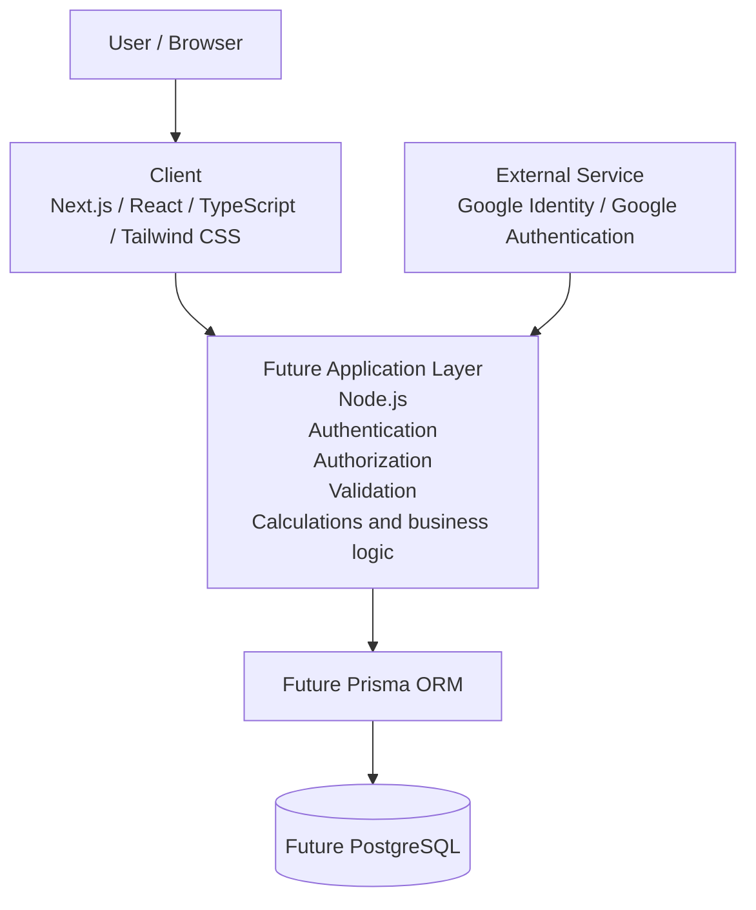
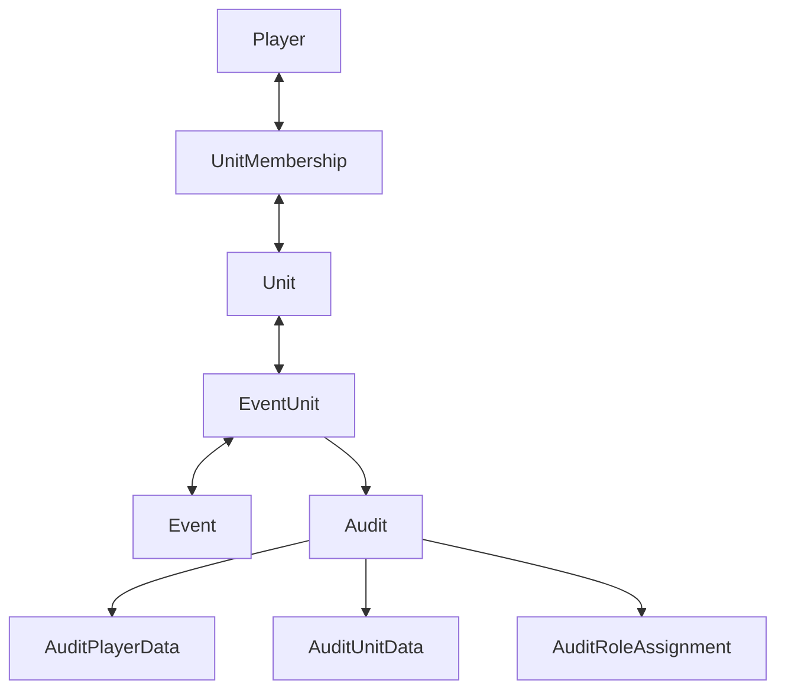

# morale.gg Initial Architecture

This document describes the initial high-level architecture for morale.gg. It is a planning artifact for Milestone 0, not a final database schema or implementation specification. Technology and domain details may be refined as requirements are validated.

## System Context / High-Level Architecture



### Planned Responsibilities

- **Client:** The planned Next.js and React frontend will provide the browser experience, using TypeScript and Tailwind CSS.
- **Application layer:** The future Node.js layer will handle authentication, authorization, validation, calculations, and business logic.
- **Data layer:** Prisma is planned as the ORM for PostgreSQL. Neither the ORM nor database is implemented as part of Milestone 0.
- **External service:** Google Identity / Google Authentication is the planned identity provider.

## Initial Domain Relationship Model



Unit hierarchy is represented conceptually as:

```text
Unit
 |
 +--> parentUnitId -> Unit
```

The model captures the initial relationships needed for players, units, memberships, events, participation, audits, and audit details. Field names, constraints, cardinalities, and the final schema have not yet been finalized.
