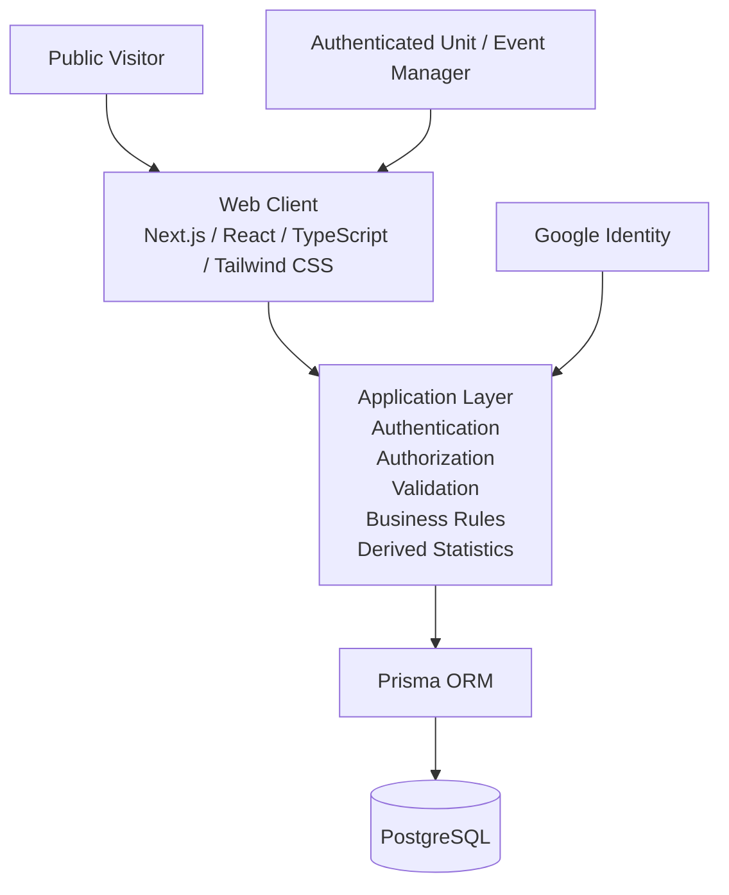
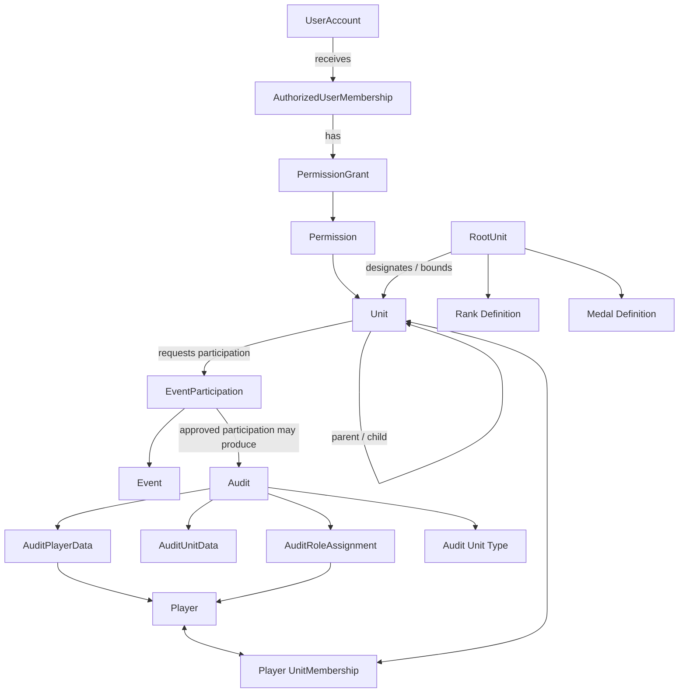
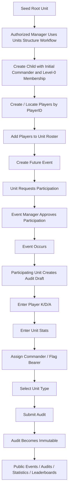

# morale.gg Architecture Overview

**Status:** Provisional and evolving  
**Scope:** Current high-level architecture for the morale.gg MVP  
**Initial game scope:** Napoleonic Wars only

This document describes the current accepted high-level architecture and domain relationships for morale.gg.

It is **not** a final database schema or detailed implementation specification. Exact classes, tables, fields, cardinalities, APIs, and module contracts must be established through tickets, module documentation, contracts, BCRs, and ADRs as development proceeds.

Where this document conflicts with `docs/SYSTEM.md` or a later approved ADR, the higher-authority source governs.

---

## 1. Product Architecture Goal

morale.gg is a web application for structured Napoleonic Wars communities to:

 - represent linked hierarchical units;
 - maintain unit rosters;
 - represent persistent players using game-specific PlayerIDs;
 - create and manage events;
 - request and approve unit participation;
 - submit structured post-event audits;
 - preserve historical organizational and performance data;
 - expose public read-only units, rosters, events, audits, basic statistics,
     and leaderboards.

The primary MVP management workflow is desktop-oriented. Public viewing should
remain reasonably usable on smaller screens.

---

## 2. System Context


```mermaid
flowchart TB
        visitor[Public Visitor]
        manager[Authenticated Unit / Event Manager]
        client[Web Client\nNext.js / React / TypeScript / Tailwind CSS]
        app[Application Layer\nAuthentication\nAuthorization\nValidation\nBusiness Rules\nDerived Statistics]
        orm[Prisma ORM]
        db[(PostgreSQL)]
        google[Google Identity]
        visitor --> client
        manager --> client
        client --> app
        google --> app
        app --> orm
        orm --> db
```

### Planned Responsibilities

**Web Client**

- public read-only browsing;
- authenticated management UI;
- responsive presentation;
- client-side interaction and form state;
- frontend visibility/gating for UX only.

**Application Layer**

- Google-authenticated user/session handling;
- authoritative authorization;
- Unit ownership and delegated-permission rules;
- operation-specific Unit structural workflows;
- Event date/time validation;
- participation request/approval workflow;
- Audit validation and submission locking;
- business-rule enforcement;
- derived statistics.

**Persistence Layer**

- persistent users/accounts and players;
- Unit profile, hierarchy, RootUnit identity, and authority;
- history-preserving Player and authorized-user membership periods;
- RootUnit-scoped Rank and Medal catalogs;
- Events and participation requests/decisions;
- Audits, audit details, and historical records.

**Google Identity**

- external authentication provider for website accounts.

Frontend visibility is not sufficient authorization. Permission-sensitive
behavior must be enforced by the application layer.

---

## 3. Core Domain Concepts

The following are conceptual domain objects or responsibilities. They are not
necessarily one-to-one with final database tables.

### UserAccount

Represents an authenticated website identity. `UserAccount` and `Player` are
separate identities; account existence grants no management authority.

---

### Player

Represents a persistent Napoleonic Wars player identified by a game-specific
PlayerID. Player records survive roster removal and may belong to multiple
Units. Richer public historical profiles remain future work.

---


### Unit

Represents an organizational Unit in an arbitrary-depth hierarchy. RootUnits
are manually designated. Each Unit has exactly one Commander; the RootUnit
owner is the Commander of its designated RootUnit Unit, not a separately
persisted owner. Commander/owner identity grants no operational permissions.

Units owns ordinary profile metadata (name, description, flag/image/icon
reference, Discord invite, and external group link), authorized-user/grant
administration, structural create/move/delete workflows, and Unit management
UI. These workflows are implemented under TKT-20260926-000019-001 and enforce
protected behavior server-side. Limited hard deletion is available only for an
otherwise-unused non-RootUnit leaf; the sole current Commander/level-0 bootstrap
membership is removed atomically with that Unit. Archival/tombstone state is
not part of MVP.

---

### Unit Management and Structural Authority

Structural actions are separate Units-owned server workflows. `MANAGE_STRUCTURE`
uses a strict-descendant anchor; a generic client-consumable boolean is not the
sole authorization mechanism.

- Child creation requires same-RootUnit structure authority, an existing
  initial Commander and matching level-0 membership, and the separately
  applicable `MANAGE_AUTHORIZED_USERS` authority for Commander assignment.
- Moves validate source and destination, remain within one RootUnit, reject
  cycles, move the complete subtree, preserve direct assignments, and
  recalculate effective authority from current ancestry.
- Hard deletion is permitted only for an otherwise-unused non-RootUnit leaf
  with no children, Player `UnitMembership`, EventParticipation, historical or
  additional authorized-user memberships, PermissionGrant/delegation history,
  or other protected references. Exactly one active level-0 membership for the
  current Commander is bootstrap state and may be removed atomically with the
  Unit; ordinary membership removal remains prohibited. The operation is
  server-authorized within existing `MANAGE_STRUCTURE` territory and performs
  all checks before mutation in one transaction. Subtree deletion, history
  cascades, and Unit archival/tombstones are not MVP behavior.
- Creation adds no operational grants implicitly.

The detailed operation policy is in ADR-20260915-002; the approved module
boundary is in BCR-20260926-003.

---

### Unit Metadata and RootUnit Catalogs

Ordinary Unit metadata is managed under `MANAGE_UNIT`. Rank and Medal catalogs
are owned by exactly one RootUnit and are managed through the narrow
Units-owned RootUnit settings capability. It permits only that RootUnit's
current owner and grants no other Unit authority. Catalog inheritance,
descendant overrides, and Player relationships are not implemented.

---

### Unit Authority

Represents delegated authority associated with a Unit under
ADR-20260915-002. The approved permission set is `MANAGE_UNIT`,
`MANAGE_STRUCTURE`, `MANAGE_ROSTER`, `REQUEST_EVENT_PARTICIPATION`,
`MANAGE_EVENTS`, `SUBMIT_AUDITS`, and `MANAGE_AUTHORIZED_USERS`.

Ordinary permissions use `SELF`, `SELF_AND_CHILDREN`, or
`SELF_AND_DESCENDANTS`. Authority is additive, delegated scope must narrow,
RootUnit boundaries are absolute, and Commander status alone grants no
operational permission. `canManageAuthorizedUsers` is permission coverage
only; user/grant mutations also enforce hierarchy, scope, and authority-level
rules. Structural operations use their operation-specific Units workflows.

---

### AuthorizedUserMembership

Represents a website User's authority membership at a Unit, distinct from a
Player roster membership. An active period has no `endedAt`; at most one active
period may exist for a `(userId, unitId)` pair. Ending access preserves the
period and grant rows, revokes its active grants transactionally, and makes
dependent grants ineffective through existing source-revocation rules.
Re-adding creates a new period. Ordinary removal cannot end the current
Commander/level-0 membership.

---

### UnitMembership

Represents the relationship between a Player and a Unit. A Player may belong to
multiple Units; duplicate active Player/Unit membership is invalid. Ending a
roster membership preserves history, and rejoining creates a new period. The
active period is derived from `endedAt IS NULL` and is owned by Players.

---

### Event

Represents an organized Napoleonic Wars Event.

Current MVP rules:

- owned by exactly one authenticated User, who is the creator;
- creation requires any currently effective Unit `MANAGE_EVENTS` permission;
- the qualifying Unit or grant is not stored on the Event and grants no
  post-creation Event authority;
- existing Event management belongs only to the owner and explicitly
  Event-authorized Users; only the owner administers that list;
- Events have no Unit ownership or authority anchor;
- normal creation is for future Events; Event information may be edited while
  eligible;
- an Event may be cancelled/deleted only before it occurs and only when no
  Audit exists.

Initial Event information includes name, scheduled date/time, event type,
description, and optional opponent/map.

---

### EventParticipation

Represents a Unit's requested or approved involvement in an Event. Typical
states are `REQUESTED`, `APPROVED`, and `DENIED`. Requests require an authorized
Unit manager; authorized Event managers approve or deny. Duplicate Event/Unit
records are prevented, and only approved participation is eligible for an
Audit.

---

### Atomic Event Unit

Represents one historical battlefield appearance within an Event. It belongs
to exactly one approved EventParticipation, while one EventParticipation may
have many atomic Event units. It is created manually after the Event and may
be mandatory or optional. It is the stable identity for the battlefield
appearance and may have zero or one Audit.

### Audit

Represents the result record attached to one atomic Event unit. A creator-owned
draft may be edited by its creator before submission; submission automatically
finalizes it. Finalized Audits, Player results, and roles are immutable and are
authoritative historical source data. Finalized result data is public while
drafts and draft-management data are private; the submitting Auth.js User is
not automatically public.

---

### AuditPlayerData

Represents player-level Audit statistics: kills, deaths, and assists. A Player
should not appear more than once in the same Audit unless a future approved
design explicitly requires otherwise.

---

### AuditUnitData

Represents Unit-level Audit statistics: tickets, flag captures, flag losses,
and stars.

---

### AuditRoleAssignment

Represents important in-game roles held by participating Players. MVP roles
include commander and flag bearer; arbitrary in-Unit positions are post-MVP.

---

### Audit Unit Type

Each atomic Audit result records one supported Napoleonic Wars Unit type:
Regular, Rifles, Cavalry, or Artillery. The type remains partitionable for
future Ranker, Commander, and General statistics and is not stored on the
persistent Unit merely because of one Event appearance.

### Event Command Group

Represents a temporary, Event-scoped command structure with a descriptive
persistent Unit, Commander Player, optional parent group, and child atomic
Event units and/or groups. Groups form a strict tree: cycles, overlapping
atomic ancestry, duplicate parents, and cross-Event edges are forbidden.
Groups may be edited or deleted by Event managers without mutating atomic units
or finalized Audits. Nested future statistics flatten to unique atomic Audits
and partition combat values by Unit type.

### Event Battlefield Sides and Result

The Event Battle domain has exactly two fixed sides: `ATTACKER` and
`DEFENDER`. Atomic Event units and Event command groups store explicit side
values; EventParticipation remains acceptance of a persistent Unit and is not
side placement. Same-side hierarchy is enforced server-side. Optional Event
side image references reuse validated site-path/HTTPS image behavior; blue and
red are presentation fallbacks only.

An Event result is an authoritative manager fact with values
`ATTACKER_WIN`, `DEFENDER_WIN`, or `DRAW`. It is eligible after the existing
Event scheduled time has passed, is not derived from Statistics, and retains
history through immutable effective/revision records. Correction approval is
pending the explicit product-owner decision recorded in ADR-20260928-008 and
BCR-20260928-006.

---

### Derived Statistics / Leaderboards

Basic public statistics are derived from submitted Audits and may include
totals, counts, averages, K/D, and simple leaderboards. Advanced analytics and
richer Player/Unit profile analytics are post-MVP.

---

## 4. Conceptual Domain Relationship Model


```mermaid
flowchart TB
    user[UserAccount]
    permission[Permission]
    unit[Unit]
    root[RootUnit]
    authorized[AuthorizedUserMembership]
    grant[PermissionGrant]
    rank[Rank Definition]
    medal[Medal Definition]
    player[Player]
    membership[Player UnitMembership]
    event[Event]
    participation[EventParticipation]
    audit[Audit]
    playerData[AuditPlayerData]
    unitData[AuditUnitData]
    roles[AuditRoleAssignment]
    unitType[Audit Unit Type]

    user -->|receives| authorized
    authorized -->|has| grant
    grant --> permission
    permission --> unit
    root -->|designates / bounds| unit
    root --> rank
    root --> medal
    unit -->|parent / child| unit
    player <--> membership
    membership <--> unit
    unit -->|requests participation| participation
    participation --> event
    participation -->|approved participation may produce| audit
    audit --> playerData
    playerData --> player
    audit --> unitData
    audit --> roles
    roles --> player
    audit --> unitType
```

This diagram is conceptual. It does not define final keys, tables, or
cardinality implementation.

## 5. Important Domain Invariants

The following are current MVP-level rules unless changed through the approved architecture process.

### Identity

- Website account identity and Player identity are separate.
- Player records use a persistent game-specific PlayerID.

### Units

- Unit hierarchy supports arbitrary depth.
- RootUnits are manually designated and each Unit belongs to exactly one
    RootUnit tree.
- Each Unit has exactly one Commander. Only the RootUnit Commander's identity
    is also called the RootUnit owner.
- Unit profile management uses `MANAGE_UNIT`; Commander status does not bypass
    operational permissions.
- Units owns server-enforced profile, authorized-user/grant, and structural
  create/move workflows. Structural operations preserve their
  operation-specific rules. Hard deletion is limited to unused non-RootUnit
  leaves under the approved protected-history and bootstrap-membership rules;
  archival and subtree deletion remain out of scope.
- Rank and Medal catalogs each belong to exactly one RootUnit and are managed
    only by that RootUnit's owner through the approved narrow capability.

### Authorized-user membership

- Membership periods are distinct from Player `UnitMembership` records.
- Active membership means `endedAt IS NULL`; a partial unique index prevents
    multiple active memberships for the same User/Unit pair.
- Ending a membership preserves it and its grants, revokes its active grants,
    and invalidates dependent grants through source lineage. Re-addition creates
    a new period.
- Ordinary removal cannot end a Unit's current Commander/level-0 membership.

### Membership

- Players may belong to multiple units.
- Duplicate active membership for the same player/unit is invalid.
- Historical membership must survive roster removal.

### Events

- Events are standalone objects owned by exactly one authenticated User.
- Any currently effective Unit `MANAGE_EVENTS` grant permits creation but
    grants no authority over an existing Event.
- Existing Events are managed only by their owner and explicitly authorized
    Event Users; only the owner administers that list.
- Participation and participating Unit hierarchy grant no Event-management
    authority, including across RootUnit boundaries.
- Events cannot normally be created in the past.
- All unit participation requires explicit approval.
- Battlefield side assignment is explicit and limited to ATTACKER or DEFENDER;
  side is never inferred from participation, Unit identity, or color.
- Event cancellation/deletion is permitted only before the event occurs and while the event has no audits.

### Audits

- Audits require approved EventParticipation through an atomic Event unit.
- One submitted Audit exists per atomic Event unit; one approved
  EventParticipation may have multiple atomic Event units.
- Submitted Audits, Player results, and roles are immutable in the MVP.
- Submitted audit data is authoritative for derived statistics.
- Event managers may construct/manage battlefield structure through
  `canManageEvent`; this never grants `canSubmitAudit`.

### Public Access

- Units, rosters, events, audits, and basic statistics are publicly viewable unless later explicitly restricted.
- Authentication is required for write operations.

---

## 6. Primary MVP Behavioral Flow


```mermaid
flowchart TD

    A[Seed Root Unit]
    B[Authorized Manager Uses Units Structure Workflow]
    C[Create Child with Initial Commander and Level-0 Membership]
    D[Create / Locate Players by PlayerID]
    E[Add Players to Unit Roster]
    F[Create Future Event]
    G[Unit Requests Participation]
    H[Event Manager Approves Participation]
    I[Event Occurs]
    J[Participating Unit Creates Audit Draft]
    K[Enter Player K/D/A]
    L[Enter Unit Stats]
    M[Assign Commander / Flag Bearer]
    N[Select Unit Type]
    O[Submit Audit]
    P[Audit Becomes Immutable]
    Q[Public Events / Audits / Statistics / Leaderboards]

    A --> B
    B --> C
    C --> D
    D --> E
    E --> F
    F --> G
    G --> H
    H --> I
    I --> J
    J --> K
    K --> L
    L --> M
    M --> N
    N --> O
    O --> P
    P --> Q
```

This flow represents the principal MVP value chain and should guide use-case analysis, module decomposition, and implementation ordering.

---

## 7. Candidate Module Boundaries

Units, Players, and Events are established modules whose current ownership is
defined by their module manifests. The remaining candidate areas below are
provisional, not final modules.

The purpose of this section is to provide architectural orientation without preempting module-creation tickets.

### Identity / Accounts

Potential ownership:

- Google-authenticated account identity;
- session/user representation;
- account-level preferences.

Does not automatically own Player identity.

### Players

Potential ownership:

- persistent PlayerID-based player identity;
- player lookup;
- player-level domain information.

### Units

Approved ownership:

- Unit profile identity and metadata;
- hierarchy, RootUnit identity/isolation, and Commander persistence;
- authorized-user membership periods and delegated permissions;
- effective authority and operation-specific structural workflows;
- RootUnit Rank/Medal catalogs and their narrow owner-only settings capability;
- Unit management UI and public Unit read-side.

Player roster persistence/mutations remain Players-owned. Event identity and
management remain Events-owned. A separate authorization module is not part of
the approved MVP boundary.

### Events

Potential ownership:

- event identity and information;
- User ownership and explicit Event-authorized Users;
- creation/editing/deletion eligibility;
- participation requests;
- participation approvals.

### Audits

Potential ownership:

- audit draft/submission lifecycle;
- player audit data;
- unit audit data;
- role assignments;
- unit type;
- submitted-audit immutability.

### Statistics / Query Layer

Basic statistics may initially remain a derived/query responsibility rather than becoming an independent module.

A separate statistics module should be created only if actual implementation pressure justifies one.

---

## 8. Expected Contract Pressure

Contracts should be created incrementally when real module integration requires them.

Likely future boundary needs include, but are not yet final contracts:

```text
Unit summary / reference
Player summary / reference
Event summary / reference
Approved participation reference
Submitted audit summary
```

Do not treat these names or shapes as established contracts until created through the normal ticket/module process.

---

## 9. Historical Integrity

Historical data should not silently change meaning when current organization data changes.

Examples requiring deliberate design include:

- unit renames after an audit;
- player membership changes after an audit;
- ownership changes;
- hierarchy changes;
- event information changes.

The exact snapshot/versioning strategy is still undecided.

When historical correctness requires preserving past state, implementation must explicitly model that need rather than relying blindly on current records.

---

## 10. Responsive / Cross-Platform Direction

The MVP is a web application.

### Management Workflows

Primary target:

- desktop/laptop browser.

Examples:

- roster management;
- unit administration;
- event management;
- audit entry.

### Public Viewing

Should remain usable on:

- desktop;
- tablet;
- mobile browser.

Examples:

- units;
- rosters;
- events;
- audits;
- leaderboards;
- basic statistics.

Native mobile applications are outside the MVP.

---

## 11. Current Technology Direction

The current planned stack remains:

- Next.js;
- React;
- TypeScript;
- Tailwind CSS;
- Node.js application/backend behavior;
- Prisma ORM;
- PostgreSQL;
- Google authentication.

These are planned technology choices, not permission to infer implementation details that have not been established.

Technology changes with architectural impact should be handled through the appropriate ADR process.

---

## 12. Explicitly Undecided

The following remain intentionally unresolved:

- future module decomposition for domains not yet established;
- exact contract shapes;
- invitation workflow and token/storage design;
- final database schema;
- exact schema cardinalities where not already required by product invariants;
- historical snapshot/versioning strategy;
- final API structure;
- caching strategy;
- statistics implementation strategy;
- deployment architecture;
- detailed privacy and threat model;
- repository validation tooling.

These decisions should emerge from use cases, tickets, component design, and implementation pressure rather than being invented prematurely.

---

## 13. Architecture Evolution

This document is a living high-level architecture overview.

It should change when approved work materially changes:

- major domain relationships;
- high-level layers;
- important system flows;
- established product invariants;
- accepted module boundaries.

Detailed module behavior belongs in `MODULE.md`.

Detailed cross-module interfaces belong in `CONTRACT.md`.

System-wide invariants belong in `docs/SYSTEM.md`.

Specific architectural decisions belong in `docs/decisions/ADR-*.md`.

Implementation details belong in code and ticket history.
