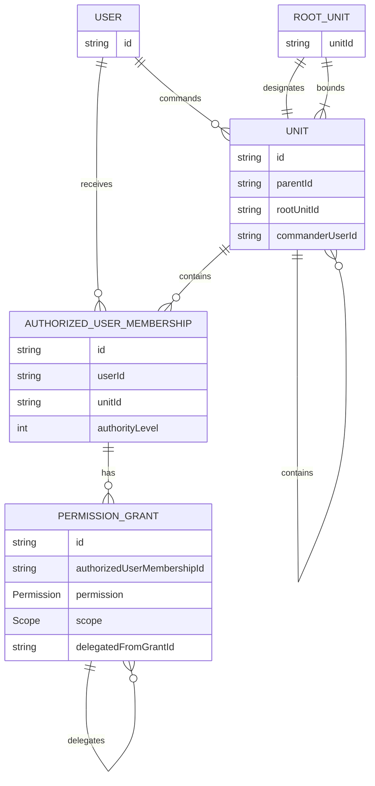

# ADR-20260915-002: RootUnit Authority and Delegated Unit Permissions Architecture

- Status: Accepted
- Date: 2026-09-15
- Related tickets: TKT-20260914-000006-001

- Human approval: Approved by the human architectural owner on 2026-09-15

> This ADR records accepted architecture direction. It authorizes the approved
> follow-up implementation work through separately governed tickets; it does
> not itself implement product behavior.
>
> Labels used below distinguish established product requirements from
> technical recommendations, alternatives, accepted RED decisions, and
> explicitly deferred EventParticipation lifecycle detail.

## Context

The product requires hierarchical Units with RootUnit isolation, one Commander
per Unit, delegated authorized-user assignments, scoped permissions, local
authority levels, structural operations, and future integration with rosters,
Events, and Audits. Authentication alone grants no management authority.

The current persistence model contains only a minimally hierarchical Unit:

```text
Unit(id, name, parentId, createdAt, updatedAt)
```

The current repository has no RootUnit designation, Commander relationship,
authorized-user assignment, website-administrator authority mechanism, roster
history, EventParticipation, or Audit persistence. The concurrent Units ticket
is limited to public hierarchy browsing. The concurrent Events ticket excludes
Unit relationships, permissions, participation, and Audits.

The existing system architecture establishes the Next.js server-side
application layer as the authoritative boundary for authentication, business
rules, authorization, and Prisma access. Public reads may remain unauthenticated;
protected writes must be authorized server-side.

The following are established product requirements and are not reopened here:

- Auth.js `User` is website identity and remains distinct from `Player`.
- Authentication alone grants no management authority.
- A Unit is the basic organizational object and hierarchy has arbitrary depth.
- A RootUnit is the highest Unit of one independently managed organization.
- Every Unit belongs to exactly one RootUnit tree.
- Authority and RootUnit-scoped configuration never cross RootUnit boundaries.
- Every Unit has exactly one Commander.
- RootUnit owner and RootUnit Commander are the same relationship in MVP.
- Commander status is separate from operational permissions.
- The seven MVP permissions are `MANAGE_UNIT`, `MANAGE_STRUCTURE`,
  `MANAGE_ROSTER`, `REQUEST_EVENT_PARTICIPATION`, `MANAGE_EVENTS`,
  `SUBMIT_AUDITS`, and `MANAGE_AUTHORIZED_USERS`.
- Ordinary Unit permissions use `SELF`, `SELF_AND_CHILDREN`, and
  `SELF_AND_DESCENDANTS`. `MANAGE_STRUCTURE` is a special structural
  permission whose Unit is a structural anchor rather than an ordinary scope.
- Permissions are additive and assignments are independent.
- Delegated ordinary scope must be strictly narrower than the delegator's
  effective scope; delegated `MANAGE_STRUCTURE` anchors must be strict
  descendants of the delegator's structural anchor.
- Equal-authority users cannot modify or remove one another.
- A descendant Commander may be replaced only by a User who is both the
  Commander of an ancestor Unit and authorized by applicable
  `MANAGE_AUTHORIZED_USERS` authority covering the target.
- Unit creation and initial Commander assignment are atomic.
- Unit moves carry descendants, preserve direct assignments, and recalculate
  inherited authority according to the new ancestry.
- RootUnit bootstrap and ownership transfer are website-administrator-only.
- Hard deletion must not destroy protected historical dependencies.

## Proposed Decision

### 1. Ownership and module boundary

**TECHNICAL RECOMMENDATION:** The Units module should own Unit hierarchy,
RootUnit designation and isolation, Commander relationships, Unit-scoped
authority assignments, effective authority evaluation, structural
authorization, and Unit deletion eligibility.

A separate authorization module is not justified for MVP. It would introduce a
new ownership boundary without a separate domain need. The Units module may
contain a private server-side authorization service and expose only stable
application-level capability functions to future consumers.

Authentication remains owned by the shared Auth.js/server authentication
boundary. It resolves an authenticated User but does not grant authority.

### 2. RootUnit representation and isolation

**TECHNICAL RECOMMENDATION:** Add an explicit RootUnit designation record
keyed by the designated Unit and an explicit `rootUnitId` on every Unit. The
RootUnit designation record is the authoritative proof that a Unit is a
RootUnit. Descendants store the designated RootUnit's identifier.

An explicit denormalized RootUnit key is recommended because it makes isolation
checks, organization-scoped queries, and future RootUnit configuration
boundaries direct and indexable. It must be maintained transactionally during
creation and movement; it is not an independent authority source that may
conflict with the parent chain.

Recommended conceptual relationships:

```text
RootUnit.unitId -> Unit.id       unique designation, no owner column
Unit.rootUnitId -> RootUnit.unitId required for every valid Unit tree
```

The RootUnit designation record should have no separate `ownerUserId` in MVP.
The designated Unit's required `commanderUserId` is the RootUnit owner by
product definition. This avoids duplicate persisted owner and Commander state.
Ownership transfer therefore changes the RootUnit Unit's Commander through the
administrator-only Commander/ownership operation; it does not update a second
owner field.

The persistence design must enforce that every non-null `Unit.rootUnitId`
references an actual `RootUnit.unitId`, not merely an arbitrary Unit ID. A
PostgreSQL foreign key from `Unit.rootUnitId` to the unique
`RootUnit.unitId`, combined with a foreign key from `RootUnit.unitId` to
`Unit.id`, is recommended. Root designation and the RootUnit's self-membership
must be created or updated in one transaction with deferred constraint
checking, or an equivalent migration/application transaction that never
commits an incomplete tree. The application must also verify that the
designated RootUnit is the topmost Unit in its tree.

A RootUnit may represent any top-level organization. MVP must not introduce a
website-wide meta-root.

### 3. Commander and ownership representation

**TECHNICAL RECOMMENDATION:** Store the current Commander as a required
`commanderUserId` on Unit. This is the smallest representation that makes the
exactly-one Commander invariant visible and directly queryable.

A separate `UnitCommander` table is an **ALTERNATIVE** appropriate only if
Commander history, effective dates, or multiple leadership roles become
required. Those features are not part of this MVP design.

The RootUnit owner is a product concept and an alias for the designated
RootUnit's Commander in MVP. It is not a second persisted relationship.
Ownership transfer is available only to a website/system administrator.

Recommended foreign-key behavior:

- User deletion is restricted when the User is a Commander or RootUnit owner
  (where RootUnit owner is resolved through the RootUnit Commander's identity).
- Unit deletion is restricted when the Unit has children or protected history.
- Authority assignments are not silently cascaded when they represent an
  auditable administrative action.
- Any application-level cleanup must occur explicitly inside a transaction.

### 4. Authorized-user membership and permission grants

**TECHNICAL RECOMMENDATION:** Separate a User's authorized membership at a
Unit from the operational permission grants attached to that membership.

Use an authorized-user membership record containing:

```text
id
userId
unitId
authorityLevel
createdByUserId
createdAt
updatedAt
```

The membership is unique by `(userId, unitId)` and gives that User one local
authority level at that Unit. It does not itself grant any operational
permission. Every Unit Commander must have a membership at the commanded Unit
at level `0`. That membership is the unique level-0 membership for the Unit.
Every non-Commander membership must have `authorityLevel >= 1`; equal
authority levels remain permitted among non-Commander users. Commander status
and membership level still do not create an operational permission grant.

The Unit Commander and membership invariants must agree transactionally:

- `Unit.commanderUserId` must identify the User whose membership at that Unit
  has level `0`.
- No other membership at that Unit may have level `0`.
- A membership cannot be changed to level `0` unless its User becomes the
  Unit's Commander in the same transaction.
- A Commander cannot be replaced or removed while leaving the Unit without a
  different unique level-0 membership.

The database should enforce non-negative levels and uniqueness of level `0`
per Unit with a partial unique index or equivalent constraint. Cross-row
consistency between the Unit Commander and that membership requires the
transactional application invariant, a deferred constraint, or an equivalent
database mechanism.

Use a separate permission-grant record containing:

```text
id
authorizedUserMembershipId
permission
scope nullable
delegatedFromGrantId nullable
createdByUserId
createdAt
updatedAt
```

The grant is unique by `(authorizedUserMembershipId, permission, scope)`.
Because structural grants use null scope, the implementation should use an
explicit structural uniqueness constraint or partial unique indexes so that a
membership cannot receive duplicate `MANAGE_STRUCTURE` grants merely because
SQL nulls compare as distinct.
Delegation lineage belongs to grants, not to the authorized-user membership.
Removing a membership removes or invalidates its grants; removing one grant
does not remove the membership or unrelated grants.

`permission` is a fixed MVP enum containing exactly seven values:

- `MANAGE_UNIT`: edit ordinary Unit metadata.
- `MANAGE_STRUCTURE`: control organizational structure rooted beneath the
  grant's Unit anchor, including eligible descendant creation, reorganization,
  movement within that subtree, and deletion. It does not use the ordinary
  scope values.
- `MANAGE_ROSTER`: administer roster/player membership for the applicable
  Unit scope.
- `REQUEST_EVENT_PARTICIPATION`: submit a request for an applicable Unit to
  participate in an Event. It does not create, edit, delete, approve, or
  reject Events or participation requests.
- `MANAGE_EVENTS`: perform Event-management operations for the applicable
  Unit scope, such as Event administration and participation review. It does
  not imply `REQUEST_EVENT_PARTICIPATION`.
- `SUBMIT_AUDITS`: submit Audits for the applicable Unit scope.
- `MANAGE_AUTHORIZED_USERS`: manage subordinate authorized users and their
  permitted assignments.

For all permissions except `MANAGE_STRUCTURE`, `scope` is a fixed MVP enum
containing exactly:

- `SELF`: the assigned Unit only.
- `SELF_AND_CHILDREN`: the assigned Unit and its immediate children.
- `SELF_AND_DESCENDANTS`: the assigned Unit and its complete subtree.

For `MANAGE_STRUCTURE`, `scope` is null. The grant's membership Unit is the
structural anchor. This should be enforced with a persistence check: a
structural grant must have null scope, and every other grant must have a
non-null ordinary scope.

Recommended grant uniqueness is:

```text
(authorizedUserMembershipId, permission, scope)
```

This prevents duplicate equivalent grants while permitting multiple
permissions, multiple scopes, and memberships at different Units. Revoking one
grant removes only authority derived from that grant. A grant cannot exist
without an authorized-user membership at its assigned Unit.

The Commander relationship is separate. Commander status alone grants none of
the seven operational permissions.

### 5. Effective authorization

All protected operations must use a server-side authorization service. Client
visibility is not a security boundary.

Given `(actingUser, permission, targetUnit, operation)`:

1. Resolve the authenticated Auth.js User. No authenticated User means denial.
2. Resolve the target Unit and its complete ancestry.
3. Reject missing, deleted, malformed, or cross-RootUnit targets.
4. Load the User's authorized-user memberships and valid grants for the
  requested permission.
5. Discard grants whose membership or delegation source chain is invalid.
6. For each grant, resolve its membership Unit and branch by permission:
  - For ordinary permissions, verify that the membership Unit is equal to or
    an ancestor of the target Unit, then apply the ordinary scope rule:
    `SELF` requires distance `0`; `SELF_AND_CHILDREN` permits distance `0`
    or `1`; `SELF_AND_DESCENDANTS` permits any non-negative distance.
  - For `MANAGE_STRUCTURE`, treat the membership Unit as a structural anchor.
    The target must be a strict descendant of that anchor for descendant
    structural operations. The anchor itself is a boundary, not a target that
    its own grant may reparent, move, or restructure.
8. The User possesses the permission when at least one valid grant covers the
  target. The authority level used for administration comes from that grant's
  authorized-user membership.
9. For administration comparisons, rank applicable authority by RootUnit
   isolation, structural ancestry, and then local authority level. Smaller
   local numbers are stronger; level `0` is Commander level.
10. For structural operations, verify the complete source, destination, and
  operation territory against the same structural anchor. Creation requires
  the prospective Unit to be a strict descendant of the anchor; a move
  requires the source Unit to be a strict descendant and the destination
  parent to be the anchor or a descendant; and deletion requires the deleted
  Unit to be a strict descendant. The anchor itself is never a manageable
  structural target under its own grant. For other operations, apply the
  relevant ordinary scope and operation-specific rules.
11. Deny by default if any required condition is absent.

Authority never propagates upward. Authority never crosses RootUnit
boundaries. Inherited authority is derived at decision time from current
ancestry; it should not be copied onto descendants as independent assignments.

When multiple grants or memberships apply, permissions are additive.
Precedence is used only to select the strongest applicable authority for
administrative comparison or to explain which grant and membership justified
an allowed operation. A more specific grant does not cancel a broader one.

### 6. Delegation and local hierarchy

**ESTABLISHED REQUIREMENT:** A User may not grant a permission they do not
possess. The delegated grant must target a Unit within the delegator's
effective authority and a subordinate recipient.

`MANAGE_STRUCTURE` is the exception to the ordinary scope ceiling. Its grant
anchor must be a strict descendant of the delegator's structural anchor. A
structural grant anchored at Regiment may therefore be delegated at Battalion,
but may not be delegated again at Regiment. The delegated grant remains
structural and has no ordinary scope value.

For ordinary permissions, the delegation ceiling is strict:

| Delegator scope | Permitted delegated scope |
|---|---|
| `SELF` | none |
| `SELF_AND_CHILDREN` | `SELF` only |
| `SELF_AND_DESCENDANTS` | `SELF` or `SELF_AND_CHILDREN` |

Equal or broader scope is denied, even when the delegator has enough
permission to operate on the target. A delegated grant must also remain
inside the delegator's RootUnit. For `MANAGE_STRUCTURE`, equal-anchor or
ancestor-anchor delegation is denied; only a strict descendant anchor is
permitted. RootUnit boundaries remain absolute for both forms.

**TECHNICAL RECOMMENDATION:** Preserve `delegatedFromGrantId` so that
delegation authority remains explainable and revocable. When a source grant is
revoked or becomes invalid, grants derived from it become ineffective.
Independent grants and the recipient's authorized-user membership remain
effective. Transitive invalidation should be implemented through the grant
delegation chain rather than by deleting unrelated memberships or grants.

Each Unit has a local numeric authority level. Smaller numbers represent
higher authority; the Commander uniquely occupies level `0`; non-Commander
memberships have level `1` or higher, and equal nonzero levels are allowed.
The level is local to the Unit and is not a RootUnit-wide ranking.

For users operating at the same Unit, the delegator's authorized-user
membership must have a strictly higher local authority than the recipient's
membership:

```text
delegator.authorityLevel < recipient.authorityLevel
```

Equal-level users are peers. They may not administratively modify or remove
one another's assignments. A higher-authority User may manage a lower-level
subordinate only when the relevant permission and target scope also apply.

The comparison first establishes applicable Unit ancestry and effective grant
coverage. Local authority level resolves hierarchy only between memberships at
the same Unit. This preserves the established rule that applicable ancestor
authority is structurally above descendant authority.

### 7. Commander assignment and replacement

Creating a child Unit and establishing its initial Commander is one
transaction. `MANAGE_STRUCTURE` alone is insufficient. The acting User must
satisfy all of these independent requirements:

1. Authenticate the acting User.
2. Possess `MANAGE_STRUCTURE` authority whose structural anchor is the
  intended parent or an ancestor of it, with the prospective child remaining
  strictly beneath that anchor.
3. Be the Commander of an ancestor Unit of the prospective child, normally
  the intended parent or one of its ancestors.
4. Possess applicable `MANAGE_AUTHORIZED_USERS` authority covering the
  prospective child.
5. Verify that the intended Commander is an existing Auth.js User.
6. Create the child with its parent, RootUnit, and exactly one Commander.
7. Create the intended Commander's authorized-user membership at the child at
  local level `0`, making it the unique level-0 membership; create no
  operational grant unless one is explicitly authorized and requested.
8. Commit only if the complete Unit satisfies the Commander and RootUnit
  invariants.

A failure at any step rolls back the whole operation. No valid Unit may persist
without exactly one Commander and exactly one matching level-0 membership.

The ancestor-Commander and `MANAGE_AUTHORIZED_USERS` checks are distinct:
Commander status supplies the structural leadership prerequisite, while the
applicable grant supplies the authority to establish or change authorized-user
membership. Neither one substitutes for the other.

Replacing a descendant Commander requires all of the following:

- the target is a strict descendant of the acting User's Commander Unit;
- the acting User is the Commander of an ancestor Unit;
- the acting User has applicable `MANAGE_AUTHORIZED_USERS` authority covering
  the target;
- the replacement User is an existing Auth.js User;
- the replacement does not violate RootUnit, assignment, or authority rules.

The replacement transaction must remove the outgoing Commander's authorized-
user membership at the target Unit. All PermissionGrants belonging to that
removed membership must be removed or invalidated in the same transaction. The
former Commander receives no automatic replacement membership, authority
level, or retained permission grants.

The replacement must become the Unit's Commander and the unique level-0
membership. Commander identity change, outgoing membership and grant cleanup,
new Commander membership establishment, and the unique level-0 transition
must commit or roll back together. If the former Commander should remain an
authorized user, an eligible superior must add them again through the normal
authorized-user administration process, including any new authority level and
permission grants.

This cleanup applies only to the target Unit. Independent memberships and
PermissionGrants held by the former Commander at other Units are unaffected.

The following cannot replace a Commander without satisfying those combined
conditions: ordinary authorized users, equal-authority peers, descendant
Commanders acting without ancestor Commander status, and Users who possess
only `MANAGE_AUTHORIZED_USERS`.

RootUnit ownership transfer is a separate administrator-only operation. It
changes the designated RootUnit Unit's Commander and therefore the resolved
owner identity; it does not update a separate owner record.

### 8. Structural operations

`MANAGE_UNIT` and `MANAGE_STRUCTURE` are intentionally separate.

`MANAGE_UNIT` covers ordinary metadata such as name, abbreviation,
description, and approved visual metadata. It does not cover parent changes,
child creation, Commander replacement, assignment administration, or deletion.

`MANAGE_STRUCTURE` is a special structural permission. It does not use
`SELF`, `SELF_AND_CHILDREN`, or `SELF_AND_DESCENDANTS`. Its membership Unit is
the structural anchor, and the grant controls the organizational structure
rooted beneath that anchor.

For a structural grant anchored at X:

- **Create descendant Unit:** the new Unit must be strictly beneath X. The
  parent may be X or any descendant of X, so the grant can create the first
  child beneath its anchor and deeper descendants.
- **Reorganize descendants:** the affected Unit must be a strict descendant of
  X. X itself, its parent, and its ancestors are outside the grant's
  structural territory.
- **Move descendant:** the moved Unit must be a strict descendant of X, and
  the destination parent must be X or a descendant of X. The move must remain
  inside X's subtree and the moved Unit cannot be moved under itself or one of
  its descendants.
- **Delete descendant:** the deleted Unit must be a strict descendant of X.
  MVP deletion remains leaf-only and protected-history checks still apply; a
  structural grant never implicitly authorizes deleting X or an entire
  subtree.

Structural operations cannot cross a RootUnit boundary, leave the actor's
structural territory, or use a grant anchored at X to reparent or move X.
These rules apply regardless of the ordinary scope values on other grants.

Changing X's own parent or placement requires a separate
`MANAGE_STRUCTURE` grant anchored at an ancestor of X. A grant anchored at X
cannot detach, reparent, move, or delete X itself.

The separate `MANAGE_AUTHORIZED_USERS` check for initial Commander
establishment is evaluated against the prospective child using its ordinary
scope model. The ancestor-Commander requirement also applies. `MANAGE_STRUCTURE`
does not silently imply either Commander-management authority or
`MANAGE_AUTHORIZED_USERS`.

A move must:

- remain within one RootUnit;
- reject moving a Unit under itself or a descendant;
- move the complete subtree;
- update `rootUnitId` consistently for affected Units;
- preserve direct assignments attached to each Unit;
- stop old inherited authority from applying;
- apply inherited authority from new ancestors;
- execute as one transaction.

The implementation should lock affected ancestors and the moved subtree, or
use an equivalent serializable strategy, so concurrent moves and grants cannot
make decisions against stale ancestry.

### 9. Safe deletion

**ESTABLISHED PRODUCT REQUIREMENT:** MVP hard deletion is leaf-only. A Unit
with children cannot be hard-deleted. Subtree deletion is not part of MVP; the
hierarchy must first be restructured so the deletion target is a leaf.

Deletion must check, at minimum:

- no child Units;
- a `MANAGE_STRUCTURE` grant anchored at an ancestor of the target Unit;
- no submitted Audit references the Unit. Submitted Audits are permanent
  historical records;
- no preserved historical roster or membership record would be destroyed;
- no draft Audit associated with the Unit remains unresolved. Draft Audits are
  not permanent historical records, but they must be explicitly removed or
  otherwise resolved before deletion and must never be silently cascade-
  deleted;
- no permanent or historical EventParticipation record would be silently
  destroyed. The exact EventParticipation lifecycle and protected-state rules
  remain deferred to EventParticipation architecture.

Rejected or cancelled participation requests are not treated as permanent
historical records by this ADR unless a later Event architecture establishes
otherwise.

The deletion transaction should lock and re-read the Unit, verify
`MANAGE_STRUCTURE` with an anchor above the target Unit, verify that the target
is a strict descendant of that anchor, verify leaf status, require explicit
resolution of draft Audits, check all protected dependencies, and commit only
if no protected record can be destroyed. Non-historical operational records
must not be silently cascaded; their cleanup policy must be explicit.

The exact EventParticipation states that become protected are not decided by
this ADR and must be finalized when EventParticipation architecture is
designed. This deferral does not permit silent destruction of records already
established as permanent or historical.

### 10. RootUnit bootstrap and bounded website administration

RootUnits are created or designated manually by website/system administrators.
The intended owner must authenticate at least once so an Auth.js User exists.
The administrator then assigns that existing User as RootUnit owner and
Commander.

**ESTABLISHED PRODUCT REQUIREMENT:** MVP defines a bounded
website/system-administrator capability used only for:

- RootUnit creation or designation;
- initial RootUnit owner and Commander assignment;
- RootUnit ownership transfer.

This capability is not generalized site-wide RBAC or a broader administrator
system. The implementation mechanism is intentionally deferred to a separate
follow-up ticket; that deferral does not reopen the bounded product capability
or its allowed operations.

### 11. Event participation and Event-management authority

**ESTABLISHED REQUIREMENT:** Unit-side participation requests and Event-side
administration are independent authority paths.

The requesting side is:

```text
Unit manager
  + REQUEST_EVENT_PARTICIPATION
  + applicable ordinary Unit scope
  -> creates a participation request for a covered Unit
```

`REQUEST_EVENT_PARTICIPATION` permits a User to submit a request on behalf of
an applicable Unit. It does not permit creating, editing, cancelling,
deleting, approving, or rejecting Events or participation requests, managing
other participating Units, or otherwise administering an Event. It uses the
ordinary `SELF`, `SELF_AND_CHILDREN`, and `SELF_AND_DESCENDANTS` scope model.
For example, `REQUEST_EVENT_PARTICIPATION @ Battalion / SELF` covers only
that Battalion, while the same permission at Regiment with
`SELF_AND_DESCENDANTS` covers Units throughout the Regiment subtree. The normal
strict delegation ceiling applies.

The Event-management side is:

```text
Event manager
  + MANAGE_EVENTS
  + applicable Event-management authority
  -> reviews, approves, or rejects participation requests
```

`MANAGE_EVENTS` represents Event administration, potentially including Event
creation, editing, eligible cancellation/deletion, participation-request
review, and approval/rejection. It also uses the ordinary Unit permission
scope model unless a later approved Event architecture defines a narrower
operation target. `MANAGE_EVENTS` does not imply
`REQUEST_EVENT_PARTICIPATION`; the permissions are independent and additive.

### 12. Future module capabilities

No speculative contracts should be created by this ADR. Future consumers need
only the following minimum semantic capabilities when real implementations
begin:

| Consumer | Producer | Minimum semantics | Formalize when |
|---|---|---|---|
| Rosters | Units authority service | Check `MANAGE_ROSTER` for a target Unit | Roster writes begin |
| Events | Units authority service | Check `REQUEST_EVENT_PARTICIPATION` for the requesting Unit, or `MANAGE_EVENTS` for Event administration | Event participation/management writes begin |
| Audits | Units authority service | Check `SUBMIT_AUDITS` for a participating Unit | Audit design begins |
| Historical consumers | Units/domain boundary | Resolve stable Unit and RootUnit identity for a record | Before historical persistence is finalized |

RootUnit is the future boundary for ranks, medals, and organization-wide
configuration. Those models and permissions are outside this ADR's MVP scope.

## Conceptual Relationship Model



Cardinalities and integrity expectations:

- A Unit has zero or one parent and zero or many children.
- Every valid Unit belongs to exactly one RootUnit tree.
- Every valid Unit has exactly one Commander.
- A User may command many Units.
- A User and Unit may have zero or one authorized-user membership.
- Every Unit has exactly one membership at authority level `0`, and it belongs
  to the Unit's Commander; no non-Commander membership may have level `0`.
- Every non-Commander membership has authority level at least `1`; multiple
  non-Commander memberships may share the same level.
- A membership has one local authority level and zero or many permission
  grants.
- Equivalent grants are unique by membership, permission, and scope.
- A RootUnit designation identifies exactly one Unit and bounds one or more
  Units through their `rootUnitId`.
- Every `Unit.rootUnitId` references `RootUnit.unitId`, so it identifies an
  actual designated RootUnit rather than an arbitrary Unit.
- RootUnit owner is the designated RootUnit Unit's Commander; no second owner
  relationship is persisted in MVP.

## Effective Authorization Questions

The server-side authorization service must answer these questions explicitly:

- **Does the User possess a required permission?** A valid grant attached to
  the User's authorized-user membership covers the target Unit.
- **Which grant provides authority?** Return the valid covering grant and its
  membership, or delegation chain, with the strongest applicable
  administrative standing.
- **Does the scope cover the target?** Compare the grant's membership Unit to
  target ancestry using the exact distance rules.
- **Does RootUnit isolation hold?** The membership Unit and target
  `rootUnitId` must resolve to the same designated RootUnit; otherwise deny
  immediately.
- **Is one authorized User subordinate?** Compare applicable Unit ancestry and
  grant coverage first; the local authority level on the authorized-user
  membership resolves hierarchy only at the same Unit. Equal standing is not
  subordinate.
- **Can the User delegate?** The User needs applicable
  `MANAGE_AUTHORIZED_USERS`, target coverage, a subordinate recipient, and a
  strictly narrower ordinary scope or, for `MANAGE_STRUCTURE`, a strict
  descendant structural anchor.
- **Can the User modify or remove an authorized User?** Only a higher-standing
  User with applicable authority may do so; equal peers are denied.
- **Can the User replace a Commander?** Only the combined ancestor Commander
  and applicable `MANAGE_AUTHORIZED_USERS` rule permits it. The operation
  must remove the outgoing target-Unit membership and its grants, establish
  the replacement's unique level-0 membership, and leave the former User's
  memberships and grants at other Units unchanged.
- **Can the User create or move a Unit?** The User needs a
  `MANAGE_STRUCTURE` grant whose structural anchor contains the prospective
  child or moved Unit as a strict descendant. For a move, both the moved Unit
  and destination parent must remain inside that anchor's subtree; ancestry,
  cycle, and RootUnit checks still apply.
- **Can the Unit be deleted?** Only after authorization and all structural and
  protected-history checks pass in one transaction.

Denial is the default. Public visibility of a Unit never implies write
authority.

## Validation Against US-AUTH-01 Through US-AUTH-15

| Story | Result under this proposal |
|---|---|
| US-AUTH-01 | `MANAGE_ROSTER @ Battalion / SELF` covers Battalion only; Company is denied and the grant cannot be delegated. |
| US-AUTH-02 | Regiment `SELF_AND_CHILDREN` covers Regiment and immediate Battalions, not Companies, and may delegate a `SELF` grant. |
| US-AUTH-03 | RootUnit `MANAGE_EVENTS @ SELF_AND_DESCENDANTS` covers that RootUnit tree only; equal scope cannot be delegated. |
| US-AUTH-04 | Equal or broader delegated scope is denied. |
| US-AUTH-05 | Equal local levels are peers and cannot modify or remove one another; a higher authority may manage a lower-level subordinate when covered. |
| US-AUTH-06 | Applicable ancestor authority is structurally above descendant local authority. |
| US-AUTH-07 | Commander replacement is denied unless the actor is an ancestor Commander with applicable `MANAGE_AUTHORIZED_USERS`; the replacement receives the unique level-0 membership, the outgoing target-Unit membership and grants are removed or invalidated, and the former User's authority at other Units is unaffected. |
| US-AUTH-08 | Commander status alone satisfies no operational permission check. |
| US-AUTH-09 | Metadata requires `MANAGE_UNIT`; structural changes require a `MANAGE_STRUCTURE` grant whose anchor contains the affected descendant territory. The anchor itself and its ancestors are not reparented through that grant; changing the anchor's placement requires an ancestor-anchored grant. |
| US-AUTH-10 | Moving a Unit preserves direct assignments and changes inherited assignments according to new ancestry. |
| US-AUTH-11 | Revoking one grant invalidates only it and dependent delegated grants; the membership and independent grants remain. |
| US-AUTH-12 | RootUnit mismatch immediately denies authority and configuration access. |
| US-AUTH-13 | Deletion is denied when protected history, including submitted Audits, would be destroyed. |
| US-AUTH-14 | A website administrator designates the RootUnit and assigns an existing Auth.js User as owner and Commander. |
| US-AUTH-15 | RootUnit remains the future boundary for ranks, medals, and organization-wide configuration without implementing them now. |

## Migration Implications

The current Unit model must be migrated only after this proposal is approved.
A later migration should:

1. identify existing root Units;
2. designate each RootUnit;
3. create RootUnit designation records;
4. authenticate or otherwise establish the required owner Users;
5. populate `rootUnitId` for every Unit;
6. populate exactly one Commander per Unit;
7. create exactly one matching level-0 authorized-user membership per Unit,
   then add other authorized-user memberships and permission grants through
   the approved authority workflow;
8. enforce required and unique constraints after backfill.

The current seed creates a root Unit but no authenticated owner or Commander.
Seed/bootstrap behavior must therefore be revised only after the bounded
administrator capability and ownership workflow are approved.

## Security and Concurrency Considerations

Implementation must provide:

- server-side enforcement for every protected operation;
- no trust in client-supplied permission, RootUnit, ancestry, or authority
  level;
- RootUnit validation on every target-sensitive operation;
- transaction-time authorization revalidation;
- cycle and cross-root move prevention;
- delegation lineage validation to prevent privilege multiplication;
- deletion checks for leaf status, submitted Audit history, preserved roster
  and membership history, unresolved draft Audits, and established permanent
  or historical EventParticipation records;
- restriction on deleting Users who are Commanders, RootUnit owners, or active
  assignment sources;
- auditable records for grants, changes, revocations, Commander changes,
  moves, deletions, and ownership transfers.

Internal denial reasons should be structured for audit logs. External responses
should avoid leaking sensitive authority relationships; depending on endpoint
semantics, inaccessible resources may be represented as not found or forbidden.

## Alternatives

### Separate authorization module

**ALTERNATIVE:** Create a first-class authorization module owning all permission
and hierarchy decisions. This may become appropriate when multiple domains share
a genuinely independent policy engine or when authority spans non-Unit domains.
For MVP it adds a boundary without a separate owner or consumer, so the Units
module is smaller and clearer.

### Derived RootUnit resolution only

**ALTERNATIVE:** Derive the RootUnit exclusively by walking parent links. This
avoids denormalization but makes every isolation query ancestry-dependent and
increases the risk of inconsistent or expensive authorization checks. The
explicit `rootUnitId` recommendation is preferred for operational integrity.

### Separate Commander table

**ALTERNATIVE:** Store Commander relationships in a dedicated table. This
supports future Commander history but is more persistence than MVP requires.
The direct required Unit field is preferred until history is a real requirement.

### Global roles or generalized RBAC

**REJECTED FOR THIS MVP:** Generalized roles, role inheritance, and global rank
systems would introduce semantics not required by the ticket. Explicit
Unit-scoped assignments preserve the required behavior with less surface area.

## Consequences

### Positive

- RootUnit isolation is explicit and queryable.
- Commander status remains distinct from operational authority.
- Permissions and scopes are additive, inspectable, and independently
  revocable.
- Structural operations cannot be confused with metadata management.
- Unit movement naturally changes inherited authority without rewriting direct
  assignments.
- Future roster, Event, and Audit consumers can depend on small semantic
  capability checks. Event participation requests and Event administration
  remain separate capabilities.

### Negative and operational

- Unit creation, movement, deletion, and assignment administration require
  transactional authorization logic.
- RootUnit and Commander backfill is required before the authority model can
  be enforced.
- Denormalized `rootUnitId` requires careful maintenance during structural
  changes.
- Hard deletion requires explicit draft-Audit resolution and dependency checks;
  EventParticipation protected states remain a future architecture concern.
- A bounded website-administrator mechanism must be designed before bootstrap
  can be implemented, but the allowed capability and operations are already
  established by this ADR.

## Remaining Human Decisions

No unresolved product questions remain in the scope of this ADR. The exact
EventParticipation states that qualify as protected historical records are
intentionally deferred to the EventParticipation architecture, while this ADR
already prohibits silently destroying any permanent or historical records.

The following **RED DECISIONS WERE APPROVED** by the human architectural owner
on 2026-09-15:

- RootUnit and Commander persistence representation.
- Units ownership of the authority system.
- Assignment lineage and revocation semantics.

The implementation mechanism for the bounded website-administrator capability
is intentionally a follow-up implementation decision. It does not expand the
capability or block acceptance of this product architecture.

## ADR/BCR Follow-up

This document is the accepted ADR for RootUnit-bounded Unit authority.
Implementation remains separately ticketed and must follow this decision.

A BCR is required only if implementation introduces a new shared cross-module
capability, public contract, or ownership boundary. No speculative BCR or
contract should be created now.

## Recommended Implementation Tickets

1. **Approve the RootUnit authority ADR**
   - Owner: architecture.
   - Dependency: human review of this proposal.

2. **Define the implementation mechanism for the bounded website-administrator capability**
   - Owner: authentication/architecture.
   - Dependency: approved authority ADR.
   - Scope: implement only the already-established RootUnit creation/designation,
     initial owner/Commander assignment, and ownership-transfer capability;
     do not introduce generalized site-wide RBAC.

3. **Implement Unit authority persistence and migration**
   - Owner: Units.
   - Dependencies: approved ADR, administrator capability, confirmed deletion
     policy.

4. **Implement effective authorization resolution**
   - Owner: Units.
   - Dependency: authority persistence migration and approved delegation rules.

5. **Implement Unit structural operations**
   - Owner: Units.
   - Dependency: effective authorization resolution.
   - Scope: create, initial Commander assignment, move, restructure, and safe
     deletion.

6. **Implement authorized-user administration**
   - Owner: Units.
   - Dependencies: effective authorization and Commander rules.

7. **Define roster authority consumer capability**
   - Owner: roster.
   - Dependency: roster write implementation.

8. **Define Event Unit targeting and authority integration**
   - Owner: Events/architecture.
   - Dependency: EventParticipation design and Units authority capability.

9. **Define Audit authority and EventParticipation historical integration**
   - Owner: audits/architecture.
   - Dependency: EventParticipation and Audit design.
   - Scope: consume the established deletion protections and finalize which
     EventParticipation states are permanent or historical; do not reopen the
     submitted-Audit, draft-Audit, or preserved-membership rules in this ADR.

## Affected Modules / Contracts

- Modules: Units, shared authentication, future rosters, future Events, future
  Audits, architecture governance.
- Contracts: none created. Future capability contracts should be formalized only
  when a real consumer is implemented.

## Review Record

Human architectural review completed on 2026-09-15 and accepted this ADR.
No Prisma schema, migration, route, UI, authorization code, concurrent Units
implementation, concurrent Events implementation, or contract was changed by
this design work. Follow-up implementation requires separately governed
tickets. The EventParticipation-state deferral is an explicit future
architecture boundary, not an authorization to silently delete historical
records.
